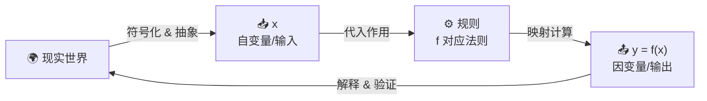
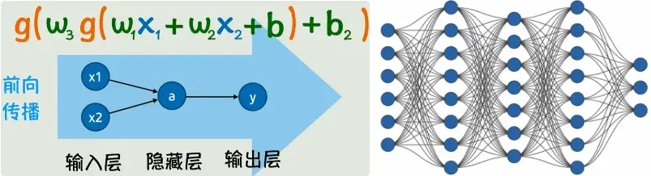

## 1 从函数映射到神经网络：智能拟合的底层逻辑

### 1\.1 函数

在数学上，函数的定义$y=f(x)$（是一种单值、确定性的映射），存在$x$就可以通过函数映射$f$，得到输出$y$。

对应于人工智能，所有人工智能任务的核心，本质上都是求解一个**从输入数据到目标输出的映射函数（Functions describe the world）**。对于任意输入$x$，我们期望通过函数变换$f(x)$，得到与真实结果一致的输出$y$，同样即

$y=f(x)$

### 1\.2 从符号主义到联结主义：从精确函数到近似拟合

早期人工智能的主流范式**符号主义**，正是基于这一逻辑：*通过人工定义精确的规则与显式函数，完成对现实世界规则的建模。*但现实场景中的绝大多数任务（如图像识别、自然语言理解），输入数据维度极高、数据间关系高度非线性，我们无法人工定义出一个精确的显式函数，来完整描述输入与输出的复杂关联。

符号主义的局限性，催生了**联结主义**的核心思路：放弃对“精确函数”的追求，转而求解一个足够接近真实分布的**近似拟合函数**。*函数无需严格经过每一个数据样本点，只需在整体上最小化与真实结果的偏差，即可满足任务需求。*

最基础的拟合形式是线性回归，其核心表达式为：

$y = wx + b$

其中$w$为权重、$b$为偏置，二者是模型的可学习参数。通过调整$w$和$b$，我们可以找到一条最优直线，完成对线性分布数据的拟合。

### 1\.3 非线性激活：突破线性模型的表达瓶颈

线性函数的拟合能力存在天然局限：无论如何叠加线性变换，最终结果仍为线性映射，无法拟合现实场景中广泛存在的非线性数据分布。例如 非线性函数$y=x^2$的散点图，无论你怎么调整线性函数的$w$和$b$，都无法得到一个比较合适的线性拟合函数。

解决这一问题的核心方案，是**在线性变换的结果后，嵌套一个非线性激活函数**，将线性映射转为非线性映射。其通用表达式为：

$f(x) = g(wx + b)$

其中$g(\cdot)$即为非线性激活函数。通过引入激活函数，模型获得了对非线性关系的表达能力，常见的激活函数包括正弦函数、指数函数，以及深度学习中最常用的ReLU函数：

$\text{ReLU}(z) = \max(0, z)$

ReLU函数通过将负值置零、正值保留的方式，实现了高效的非线性变换，同时有效缓解了深层网络的梯度消失问题，是当前深度学习中应用最广泛的激活函数。

### 1\.4 多层嵌套与神经网络的诞生

单层非线性变换的拟合能力仍然有限，面对复杂的高维数据，我们可以通过**多层线性变换\+激活函数的嵌套**，构建更强大的拟合模型。例如一个两层的非线性变换，其表达式为：

$g\left(w_{3} \cdot g\left(w_{1} x_{1}+w_{2} x_{2}+b_{1}\right)+b_{2}\right)$

这种嵌套结构可以无限拓展，根据**通用近似定理**，只要激活函数不是“纯粹的直线”，且目标函数不是“绝对疯狂”的函数，一个具有足够多神经元的单隐藏层前馈网络，能够以任意精度逼近闭区间上的任意连续函数。

> 仅含单个隐藏层的前馈神经网络，只要神经元数量充足，就能以任意可控的极小误差，拟合闭区间内的任意连续函数。
> 

为了更清晰地描述这种嵌套结构，我们引入了神经网络的基础概念：

- **神经元**：对应一次“线性变换\+非线性激活”的最小计算单元，即上述公式中的一个独立计算节点；

- **输入层**：接收原始输入数据的网络层，不进行计算变换；

- **隐藏层**：位于输入层与输出层之间的中间计算层，核心作用是对输入数据进行逐层的特征提取与非线性变换；

- **输出层**：输出模型最终预测结果的网络层。

多个神经元通过全连接的方式互相组合，形成的多层网状结构，即为**神经网络**。

### 1\.5 前向传播：神经网络的计算流程

神经网络的计算过程，本质是信号从输入层传入，依次经过每一个隐藏层的线性变换与非线性激活，最终从输出层得到预测结果的过程，这一过程被称为**前向传播**。

对于一个$L$层的全连接神经网络，其前向传播的通用矩阵表达式为：

$A^{[l]} = g\left(W^{[l]} A^{[l-1]} + b^{[l]}\right)$

其中：

- $l$为网络的层序号，$A^{[0]}$为输入层的原始数据矩阵；

- $W^{[l]}$、$b^{[l]}$分别为第$l$层的权重矩阵与偏置向量；

- $g(\cdot)$为第$l$层的激活函数；

- $A^{[l]}$为第$l$层的输出矩阵，同时作为第$l+1$层的输入。

基于矩阵的表达方式，不仅简化了深层网络的数学描述，还能充分利用GPU的并行计算能力，大幅提升神经网络的计算效率。

---